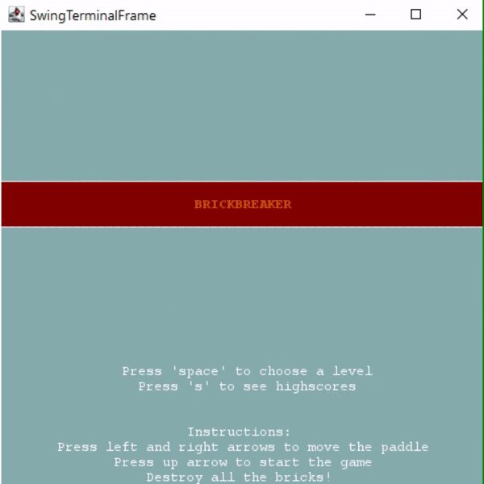

# LPOO 2020
Project developed for LPOO by FEUP in 2019/2020.

# BRICKBREAKER
The player is in control of a sliding platform that can bounce the ball into the bricks above. The player must use angles and rebounds to control the direction the balls move. If the balls fall into the abyss below, you’ll lose a life. Once a player manages to destroy all the bricks, he passes the level and the difficulty increases.

 

Developed by Ricardo Cardoso and @martandradelobo

