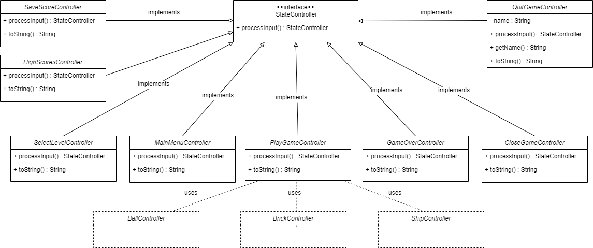
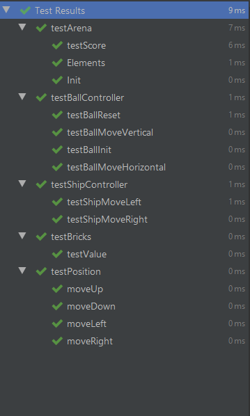

# LPOO - 2020 - G32 - BRICKBREAKER

The player is in control of a sliding platform that can bounce the ball into the bricks above. The player must use angles and rebounds to control the direction the balls move. If the balls fall into the abyss below, you’ll lose a life. Once a player manages to destroy all the bricks, he passes the level and the difficulty increases.  
This project was developed by Ricardo Cardoso (up201604686@fe.up.pt) and Marta Lobo (up201604530@fe.up.pt) for LPOO 2019⁄20.

## Implemented Features
- [x] **Arena** - with insurmountable barrier
- [x] **Platform** - the player must be able to move the platform side to side when arrow left or arrow right are pressed.
- [x] **Bouncing ball** - must collide with brick and barriers
- [x] **Normal bricks** - must disappear once their score hits 0
- [x] **Collision detection** 
- [x] **Menu and Game Over Screen** - main menu must have the title of the game and its instructions, game over screen must have options to quit or play again
- [x] **Lifes** - how many lifes the player has, must decrease whenever the player can't catch the ball
- [x] **Score** - must increase differently depending on the type of bricks that are hit 
- [x] **Levels** - 1st level must start with normals bricks only; difficulty increases throughout the levels -> more special bricks, less normal bricks
- [x] **Save score and see HighScores table** - when the game ends the player can choose to save his score and when in the MainMenu the player has one option to see the highscores table

## Planned Features
- [ ] **Special bricks** - drop different special powers.
- [ ] **Enemies** - must throw bombs; must disappear once it is hit 3 times by the bouncing ball

## GIF

 

## Design 
### 1. Separating the Game's Modules
#### 1.1) Problem in Context
The first challenge was finding a correct way to differentiate the physical aspects of our program: 
We soon understood that we should separate, for example, the **general logic** of the game (such as the movements of the ship, ball and bricks and other mechanic aspects of the game) from the **"drawing"** aspects, which should display that general game logic into a screen, so that the game could be understandable and user friendly. 
This separation is useful by allowing changes on one component, without having to change the other parts; and this way we can easily prevent the violation of the **Single Responsability Principle**.

#### 1.2) The Pattern
To maintain some form of organization, we followed the **Model-View-Controller (MVC)** architectural pattern.
In short, the **MVC** design pattern specifies that an application consists of a data **model** (it directly manages the data, logic and rules of the application),
the **view** of the information, and the **control** of the information (accepts inputs and converts them to commands). 
The pattern requires that each of these be separated into different objects. 

#### 1.3) Implementation
Here's how we decided to implement the pattern:

 

The classes can be found in the following files:

* [LanternaDisplay](../src/main/java/View/LanternaDisplay.java)
* [Arena](../src/main/java/Model/Arena.java)
* [StateController](../src/main/java/Controller/StateController.java)

#### 1.4) Consequences
As said in _**1.1)**_, besides the organization it makes it easier to change only one component of the game, and to keep all the others intact.

### 2. Instantiation of the Elements
#### 2.1) Problem in Context 
When creating an element, whether it is the ship, the ball, the bricks or even the walls, we wanted to save its position because that way it can be checked and modified throughout the game.

#### 2.2) The Pattern
We followed **Composite Pattern** because this simplifies the process of accessing the position of different objects.

#### 2.3) Implementation
The objects instantiation is made with Element by saving the position, working together with each subclass's constructor (ex: Ball, Ship, Brick, Wall).

 

The classes can be found in the following files:

* [Element](../src/main/java/Model/Element.java)
* [Ship](../src/main/java/Model/Ship.java)
* [Brick](../src/main/java/Model/Brick.java)
* [Ball](../src/main/java/Model/Ball.java)
* [Wall](../src/main/java/Model/Wall.java)

#### 2.4) Consequences
Promoting consistency around the models mentioned above, since they all have a Position attribute and functions that revolve around it throughout the code that are always accessed the same way. 

### 3. Menu Management
#### 3.1) Problem in Context 
In order to have a clean and intuitive menu navigation, we decided we needed to find a way to allow different game stages.

#### 3.2) The Pattern
We followed a **State Pattern** so we could change the program depending on its state, wether it was the Main Menu, the game itself or even a final state when the game is over.  

#### 3.3) Implementation
Game has stateController as an attribute (StateController). This indicates the state of the game (MainMenu, SelectLevel, PlayGame, GameOver, CloseGame).

 

The classes can be found in the following files:

* [StateController](../src/main/java/Controller/StateController.java)
* [MainMenuController](../src/main/java/Controller/MainMenuController.java)
* [PlayGameController](../src/main/java/Controller/PlayGameController.java)
* [SelectLevelController](../src/main/java/Controller/SelectLevelController.java)
* [GameOverController](../src/main/java/Controller/GameOverController.java)
* [CloseGameController](../src/main/java/Controller/CloseGameController.java)
* [QuitGameController](../src/main/java/Controller/QuitGameController.java)
* [SaveScoreController](../src/main/java/Controller/SaveScoreController.java)
* [HighScoresController](../src/main/java/Controller/HighScoresController.java)
* [BrickController](../src/main/java/Controller/PlayGame/Brick.java)
* [BallController](../src/main/java/Controller/PlayGame/Ball.java)
* [ShipController](../src/main/java/Controller/PlayGame/Ship.java)

#### 3.4) Consequences
With this implementation we could easily localize the different states and make its transitions explicit. This way we could easily control what models should be updated, which functions from the controller should be called and what should be drawn on the screen depending on the active state.

### 4. Creating Arenas
#### 4.1) Problem in Context 
We realized that for creating an arena we need to create different objects, such as Walls, Bricks, one Ship and one Ball. To help us with this we created a class called ArenaCreator that is in charge of creating all those objects just with the information of the level number and the initial score.

#### 3.2) The Pattern
To help us with this we followed the Factory Pattern eliminating the need to know witch objects we need to create every time we want to build a new arena.

#### 3.3) Implementation
Here's how we decided to implement the pattern:

 

The classes can be found in the following files:

* [ArenaCreator](../src/main/java/Model/Arena.java)
* [Arena](../src/main/java/Model/Arena.java)
* [Ship](../src/main/java/Model/Ship.java)
* [Brick](../src/main/java/Model/Brick.java)
* [Ball](../src/main/java/Model/Ball.java)
* [Wall](../src/main/java/Model/Wall.java)

#### 3.4) Consequences
With this implementation we found a way to simplify the process of manipulating so many elements.

## Know Code Smells and Refactoring Suggestions 
### 1. Long Method
#### 1.1 Code Smell
A noticeable code smell we happened to developed was a **Long Method** which is a method that contains too many lines of code. This happened in hitBrick(), included in [BallController](../src/main/java/Controller/PlayGame/BallController.java) class, which is a method used to manipulate the direction of the ball in relation to the bricks when a collision occurs between them. It turned out to be a bit longer than it should due to a considered number of movement scenarios.

#### 1.2 Refactoring
Although we find this code easy to understand (besides its size), we know classes with short methods are easier to deal with. This could be avoided by using Extract Method. 

### 2. Switch Statements / Sequence of if statements
#### 2.1 Code Smell
On some classes included in the Controller, in processInput() the recurrent use of switch cases is evident. This happens in order to make it easier to add functionalities to the program.

#### 2.2 Refactoring
We didn't find this crucial to be refactored because we are using switch operators that perform simple actions. 

### 3. Comments
#### 3.1 Code Smell
On [PlayGameController](../src/main/java/Controller/PlayGameController.java) we happen to have some explanatory comments concerning collision detection. We did it so we could easily see all the collision scenarios between the ball, ship, bricks and walls.

#### 3.2 Refactoring
We don't feel it would be impossible to understand the code without comments, otherwise we would change the code structure in a way that makes comments unnecessary. But it helped us organizing our thoughts while processing collisions.

### 4. Shotgun Surgery
#### 4.1 Code Smell
The Shotgun Surgery code smell is present whenever making any modifications requires that you make many small changes to many different classes. This code smell was present at the beginning of our development phase, before we began refactoring the program. 

#### 4.2 Refactoring
When we took the time to reorganize our code and refactor the MVC model, we could easily aggregate functions and classes with similiar proposes, by using the Mode Method and Move Field techniques. We soon began to understand the behaviours of all the classes and their uses in order to start making a functional game.

## Testing
  

## Self-Evaluation

- Ricardo Cardoso: 50%
- Marta Lobo: 50%
