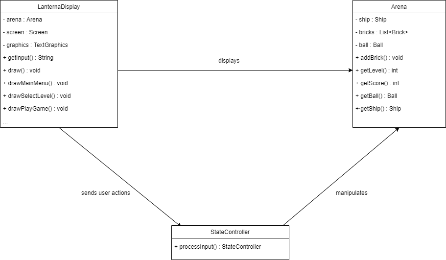

# LPOO - 2020 - G32 - BRICKBREAKER

The player is in control of a sliding platform that can bounce the ball into the bricks above. The player must use angles and rebounds to control the direction the balls move. If the balls fall into the abyss below, you’ll lose a life. Once a player manages to destroy all the bricks, he passes the level and the difficulty increases.  
This project was developed by Ricardo Cardoso (up201604686@fe.up.pt) and Marta Lobo (up201604530@fe.up.pt) for LPOO 2019⁄20.

## Implemented Features
- [x] **Arena** - with insurmountable barrier
- [x] **Platform** - the player must be able to move the platform side to side when arrow left or arrow right are pressed.
- [x] **Bouncing ball** - must collide with brick and barriers
- [x] **Normal bricks** - must disappear once they are hit by the ball
- [x] **Collision detection** 
- [x] **Menu and Game Over Screen** - main menu must have the title of the game and its instructions, game over screen must have options to quit or play again
- [x] **Lifes** - how many lifes the player has, must decrease whenever the player can't catch the ball
- [x] **Score** - must increase differently depending on the type of bricks that are hit 
- [x] **Levels** - 1st level must start with normals bricks only; difficulty increases throughout the levels -> more special bricks, less normal bricks
- [x] **Special bricks** - must take more hits till they disappear 

## Planned Features
- [ ] **Enemies** - must throw bombs; must disappear once it is hit 3 times by the bouncing ball

## Design 
### 1. Separating the Game's Modules
#### 1.1) Problem in Context
The first challenge was finding a correct way to differentiate the physical aspects of our program: 
We soon understood that we should separate, for example, the **general logic** of the game (such as the movements of the ship, ball and bricks and other mechanic aspects of the game) from the **"drawing"** aspects, which should display that general game logic into a screen, so that the game could be understandable and user friendly. 
This separation is useful by allowing changes on one component, without having to change the other parts; and this way we can easily prevent the violation of the **Single Responsability Principle**.

#### 1.2) The Pattern
To maintain some form of organization, we followed the **Model-View-Controller (MVC)** architectural pattern.
In short, the **MVC** design pattern specifies that an application consists of a data **model** (it directly manages the data, logic and rules of the application),
the **view** of the information, and the **control** of the information (accepts inputs and converts them to commands). 
The pattern requires that each of these be separated into different objects. 

#### 1.3) Implementation
Here's how we decided to implement the pattern:

 

The classes can be found in the following files:

* [LanternaDisplay](../src/main/java/View/LanternaDisplay.java)
* [Arena](../src/main/java/Model/Arena.java)
* [PlayGameController](../src/main/java/Controller/PlayGameController.java)
* [BrickController](../src/main/java/View/LanternaDisplay.java)
* [BallController](../src/main/java/View/LanternaDisplay.java)
* [ShipController](../src/main/java/View/LanternaDisplay.java)

#### 1.4) Consequences
As said in _**1.1)**_, besides the organization it makes it easier to change only one component of the game, and to keep all the others intact.

### 2. Instantiation of the Elements
#### 2.1) Problem in Context 
When creating an element, wether it is the ship, the ball, the bricks or even the walls, we wanted to save its position because that way it can be checked and modified throughout the game.

#### 2.2) The Pattern
We followed **Abstract Factory** as we have a family of products that is designed to work together, needing to reinforce this constraint.

#### 2.3) Implementation
The objects instantiation is made with **Element** by saving the position, working together with each subclass's constructor (ex: Ball, Ship, Brick, Wall). 

 

The classes can be found in the following files:

* [Element](../src/main/java/Model/Element.java)
* [Ship](../src/main/java/Model/Ship.java)
* [Brick](../src/main/java/Model/Brick.java)
* [Ball](../src/main/java/Model/Ball.java)
* [Wall](../src/main/java/Model/Wall.java)

#### 2.4) Consequences
Promoting consistency around the models mentioned above, since they all have a Position attribute and functions that revolve around it throughout the code that are always accessed the same way. 

### 3. Menu Management
#### 3.1) Problem in Context 
In order to have a clean and intuitive menu navigation, we decided we needed to find a way to allow different game stages.

#### 3.2) The Pattern
We followed a **State Pattern** so we could change the program depending on its state, wether it was the Main Menu, the game itself or even a final state when the game is over.  

#### 3.3) Implementation
Game has stateController as an attribute (StateController). This indicates the state of the game (MainMenu, SelectLevel, PlayGame, GameOver, CloseGame).

 

The classes can be found in the following files:

* [StateController](../src/main/java/Controller/StateController.java)
* [Game](../src/main/java/Controller/Game.java)
* [MainMenuController](../src/main/java/Controller/MainMenuController.java)
* [PlayGameController](../src/main/java/Controller/PlayGameController.java)
* [SelectLevelController](../src/main/java/Controller/SelectLevelController.java)
* [GameOverController](../src/main/java/Controller/GameOverController.java)
* [CloseGameController](../src/main/java/Controller/CloseGameController.java)

#### 3.4) Consequences
With this implementation we could easily localize the different states and make its transitions explicit. This way we could easily control what models should be updated, which functions from the controller should be called and what should be drawn on the screen depending on the active state.

## Know Code Smells and Refactoring Suggestions 
### 1. Speculative Generality
For now, class Enemy is a speculative generality because it was created to support anticipated future features, and currently has no use.

### 2. Switch Statements / Sequence of if statements
In order to detect and process user input, when an important key is pressed, we create an event. 
And in order to process it we have a sequence of if statements that calls diferent methods to update the game. We want to eliminate these if statements, as it is a code smell, and find a way to properly process the events generated by user input.

## Testing
 

TODO add mutation report here

## Self-Evaluation
